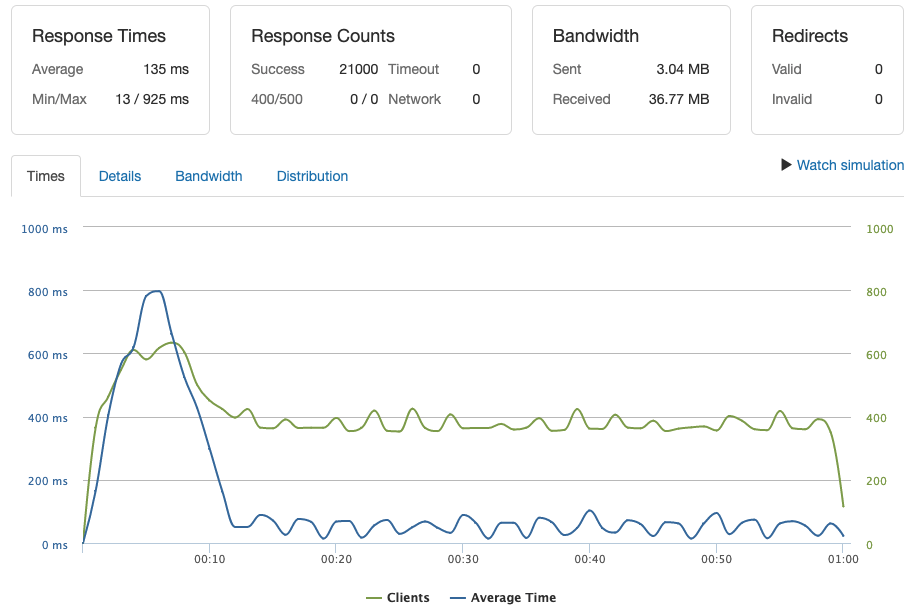

# Mithril-products

Service built to house product information for the Mithril e-commerice application, designed and optimized for its specific use-case.
- **Usage:** Users browse through many products on site, looking to quickly skim through product details. Infrequent inventory updates.
- **Design:** Optimize for high-volume low-latency reads from database. Write speed deprioritized. Data reliability requirements are nominal.

## Description

This service routes requests with an Express server running on Node.js. Utilizing a Mongoose ODM to communicate with a MongoDB instance, exceptional performance is achieved through proper database design and minimizing network load. 

The database is seeded with data from csv files, which have been cleaned using Node's native read and write streams to manage memory usage. The entire service, including seed data and loading script, is containerized, hosted on Dockerhub, and orchestrated at start-up using Docker-compose.

### Performance

On a cloud-based AWS EC2 t2.micro machine (~3.3 Ghz CPU, 1 GB memory), one instance of this service can reliably achieve the following performance on all API routes.
- **350 RPS** (requests per second) to randomized products
- **135ms latency**
- **0.00% error rate**

Locally on a 2018 MacBook Pro (6-core Intel Core i9 @ 2.9 Ghz, 32 GB memory), one instance is able to reliably handle at least **1100 RPS** on all routes

Optimizations with highest performance benefit:
- Proper indexing of Mongo collection for common API routes (additional storage usage acceptable, non-constrained)
- Normalization of subset of primary products collection (reduce query response size, additional storage usage acceptable)
- Mongoose select method plucks only the fields required from a document (reduce network load)
- Mongoose lean method strips Mongoose Document functionality (reduce network load, GET requests only, extra functionality not needed)

## Technologies

<table>
  <tr>
    <td>Framework</td>
    <td></td>
  </tr>
  <tr>
    <td>Database</td>
    <td></td>
  </tr>
  <tr>
    <td>Containerization & Deployment</td>
    <td>
</td>
  </tr>
  <tr>
    <td>Testing & Diagnostics</td>
    <td>Loader.io, Artillery.io, New Relic</td>
  </tr>
</table>

## Installation

This service is containerized and available on Dockerhub in its latest iteration. The startup process will require a Unix-based operating system capable of running Docker virtual environments.

1. Ensure Docker is [installed](https://www.digitalocean.com/community/tutorials/how-to-install-and-use-docker-on-ubuntu-16-04) and running.
2. Copy docker-compose-aws.yml file into current directory.
3. Execute `docker-compose -d -f docker-compose-aws.yml up`
4. Reroute port 80 (internet) to 3001, where service is running using `Sudo iptables -t nat -A PREROUTING -i eth0 -p tcp --dport 80 -j REDIRECT --to-port 3001`

## Team Members

- [Daniel He](https://github.com/daniel-he-dev)

## Roadmap

- Implement in-memory Redis LRU cache to optimize frequented queries.
- Implement nginx load balancing for horizontal scalability.
- Debottleneck database queue with MongoDB sharding.

## License

MIT License
